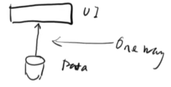
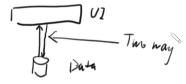

# Blazor Data Binding

- Application UI can do two things:

  1. Display information
    - Calls as one way data binding
 
    

  2. Manipulate information 
    - Calls as two way data binding
    
    

- Input
  - checkbox
  - radio button
  
- select/option
- list
- table
